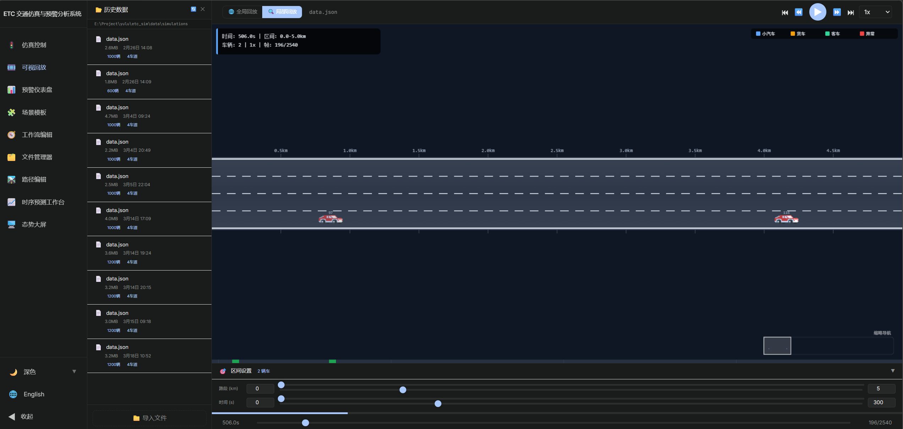
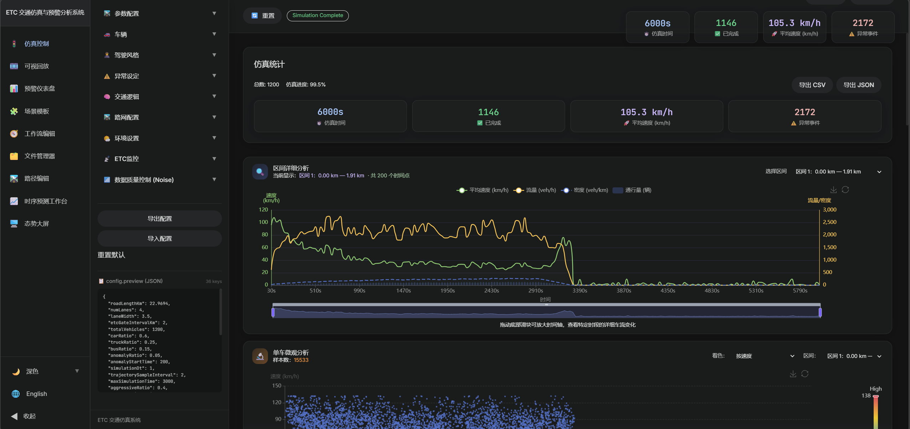
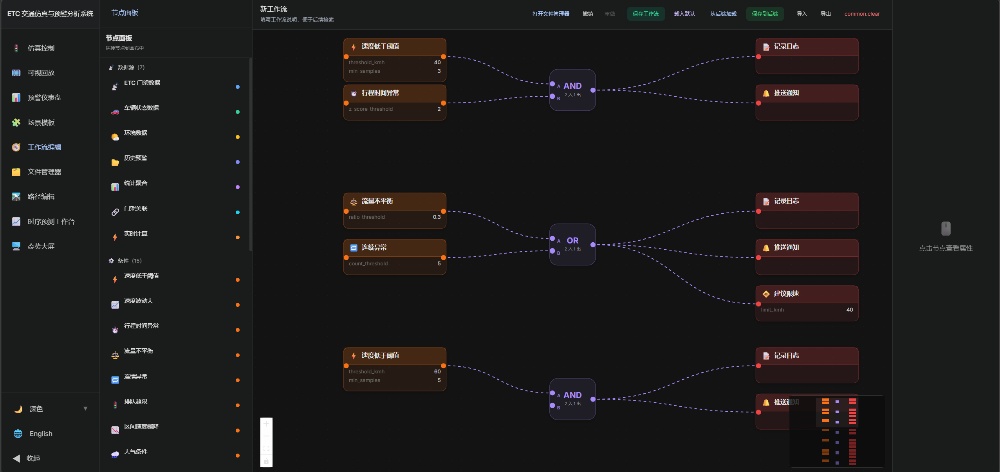
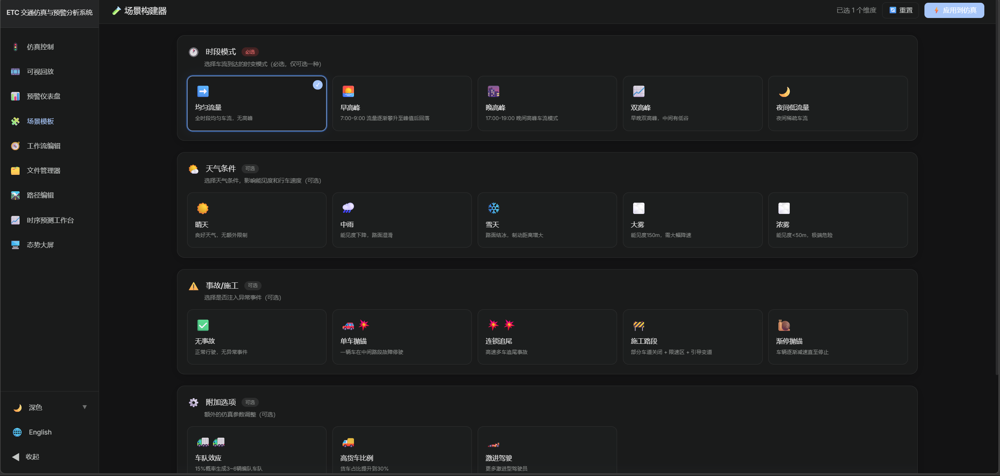
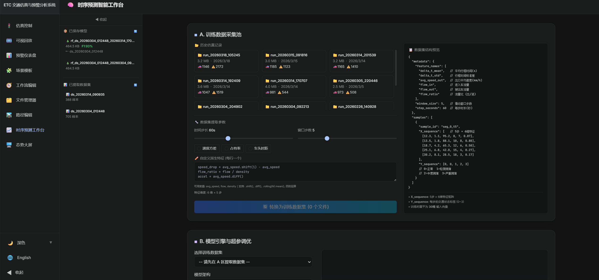
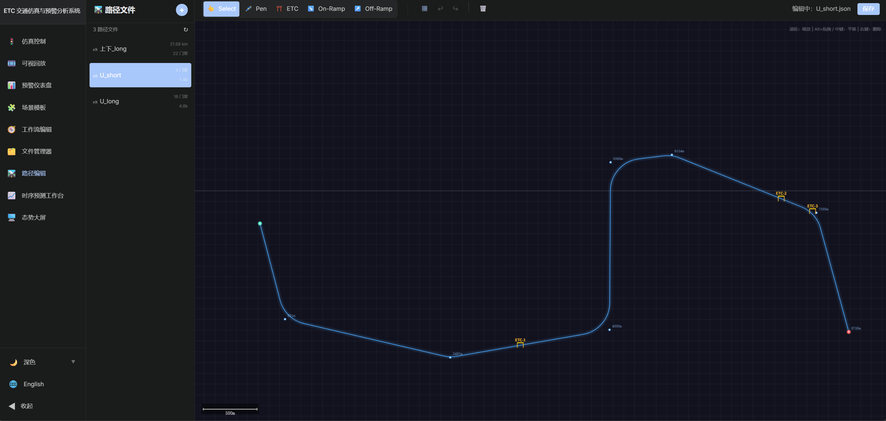
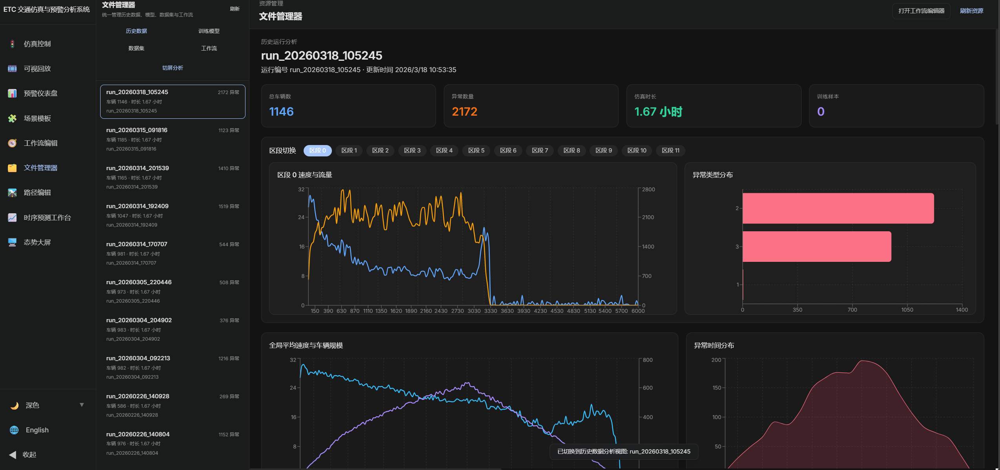

# ETC 交通仿真系统（ETC Traffic Simulation）

高速公路 ETC 车流仿真、预警规则引擎与微观异常分析平台。

> 维护状态：项目正在进行恢复性维护。当前阶段优先修复安全边界、启动流程和仿真正确性，暂不继续扩展新功能。

## 项目简介

本项目基于 IDM（智能驾驶员模型）和 MOBIL 换道模型构建高速公路交通仿真系统，支持车辆类型、驾驶风格、天气、坡度、异常事件和 ETC 门架等场景配置，并提供 FastAPI + React 的可视化界面、规则引擎、历史回放与分析能力。

---

## 功能特性

| 核心能力 | 说明 |
| --- | --- |
| 🚗 **实时仿真可视化** | Canvas 渲染道路、车辆和 ETC 门架，支持动态极速模式与自适应时间控制 |
| 🔔 **预警规则引擎** | 可配置条件—动作规则，支持多种评估条件和输出动作 |
| 🎨 **可视化工作流编辑器** | 使用 React Flow 构建和调整预警链路 |
| 📊 **专业分析图表** | 提供时空图、基本图、拥堵恢复过程和车流微观画像等分析视图 |
| ⚙️ **微观场景配置** | 支持车流构成、驾驶风格、天气、坡度和自定义路网 |
| 🔍 **交互式区间分析** | 展示指定区间的速度、流量、密度趋势及车辆轨迹 |

---

## 界面展示

| **实时仿真可视化** | **仿真统计与分析** |
| :---: | :---: |
|  |  |
| **可视化工作流编辑器** | **场景参数构建器** |
|  |  |
| **时序预测工作台** | **路网与路径编辑** |
|  |  |
| **文件与历史记录管理** |  |
|  |  |

---

## 环境要求

项目统一使用以下开发环境：

- Conda：Miniconda 或 Anaconda
- Python 3.11
- Node.js 20（由 Conda 环境安装）
- Conda 环境名：`yulu-sim`

## 快速开始

### 1. 一键启动（推荐）

#### Windows

```bat
cd etc_sim
start.bat
```

也可以直接双击 `etc_sim/start.bat`。脚本会在缺少环境时根据 `environment.yml` 创建 `yulu-sim`，安装前端依赖，并依次启动 FastAPI 后端和 Vite 前端。

#### Linux / macOS

```bash
cd etc_sim
chmod +x start.sh
./start.sh
```

脚本会启动后端、等待 `/health` 健康检查通过，然后启动前端；退出脚本时会同步关闭后端进程。

### 2. 手动启动

#### 创建环境

在仓库根目录执行：

```bash
conda env create -f etc_sim/environment.yml
conda activate yulu-sim
```

环境已经存在时，无需重复创建。

#### 启动 FastAPI 后端

在仓库根目录执行：

```bash
conda activate yulu-sim
python -m uvicorn etc_sim.backend.main:app --reload --host 0.0.0.0 --port 8000
```

API 文档地址：`http://127.0.0.1:8000/api/docs`。

#### 启动 Vite React 前端

在另一个终端执行：

```bash
conda activate yulu-sim
cd etc_sim/frontend
npm ci
npm run dev
```

浏览器访问：`http://localhost:3000`。

### 3. 运行离线 CLI 仿真

`etc_sim/main.py` 是离线仿真入口，不是 Web 后端入口：

```bash
conda activate yulu-sim
python -m etc_sim.main
```

导出默认配置：

```bash
python -m etc_sim.main --json
```

---

## 安全说明

恢复维护期间，后端已经停用以下旧功能：

- 通过 API 执行任意 Python 代码；
- 通过 API 创建、删除 Conda 环境；
- 通过 API 安装任意 pip 包；
- 文件管理模块中的脚本读取、修改和执行接口。

这些功能原先直接使用宿主机权限运行，缺少鉴权与隔离，不应在局域网或公网服务中开放。后续如重新引入脚本分析，必须使用独立低权限容器或进程沙箱。

---

## 预警规则引擎

引擎采用 `条件原子 → 规则组合 → 动作输出` 的三层结构。前端 `/workflow` 页面用于构建和调整告警链路。

预置规则包括拥堵检测、疑似事故预警、严重排队、ETC 漏读异常和恶劣天气限速等。评估模块可以使用 Precision、Recall 和 F1 Score 等指标对规则阈值进行分析。

---

## 文档与目录

- [开发者指南](./docs/developer_guide.md)
- [仿真物理机制](./docs/simulation_mechanics.md)
- [系统工作原理](./docs/system_workflow.md)

| 目录 | 作用 |
| --- | --- |
| `docs/` | 系统架构、物理模型和开发约定 |
| `etc_sim/backend/` | FastAPI 接口、WebSocket 和数据服务 |
| `etc_sim/frontend/` | React 页面、图表和 Zustand 状态管理 |
| `etc_sim/models/` | 预警、环境、特征与异常分析模型 |
| `etc_sim/simulation/` | Python 仿真主循环 |
| `etc_sim/core/` | 车辆、IDM 跟驰和 MOBIL 换道模型 |

---

## 结果导出

- UI 可视化：分析面板展示仿真和历史运行结果；
- JSON：Web 运行记录保存在 `etc_sim/data/simulations/<run_id>/`；
- CLI JSON：离线结果保存在 `etc_sim/data/results/`；
- CSV：部分结果可导出用于离线分析。

---

**License：MIT**
