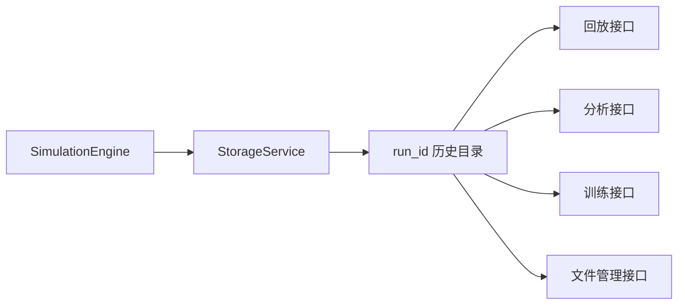
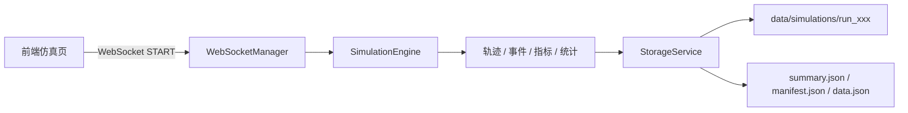
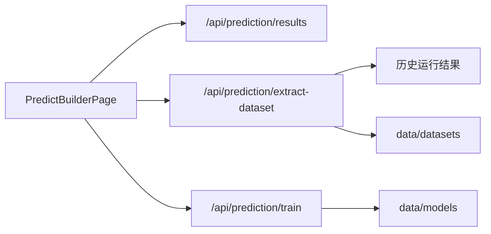

# API 交互关系与历史存储设计

## 1. 文档目标

本文档聚焦历史运行系统，说明以下内容：

- 实时仿真、历史存储、回放、训练、分析之间的接口关系
- 当前历史数据的核心结构与职责边界
- 路径轨迹嵌入后的推荐数据模型
- 面向性能优化的存储分层策略
- 新旧接口共存下的迁移原则

本文件与 `../system_working_principles.md` 的关系是：

- `system_working_principles.md`
  讲系统整体工作原理
- 本文档
  讲历史运行与存储专题

---

## 2. 当前历史系统的四条主线

围绕一次仿真运行，当前系统存在四条数据消费主线：

1. 历史回放
2. 训练数据提取
3. 统计分析
4. 文件管理与资源浏览

它们共用同一份运行结果，只是读取视角不同。



---

## 3. 当前主要 API 交互关系

### 3.1 实时仿真到历史存储



特点：

- 实时仿真负责生成运行结果
- 历史存储负责将结果组织为可回放、可分析、可训练的结构

### 3.2 历史回放

当前同时存在两套接口：

#### 旧式文件接口

- `GET /api/files/output-files`
- `GET /api/files/output-file-info`
- `GET /api/files/output-file-chunk`
- `GET /api/files/output-file`
- `GET /api/files/simulation-gates`

特点：

- 面向文件路径
- 用于兼容旧页面和旧数据结构

#### 新式运行接口

- `GET /api/runs`
- `GET /api/runs/{run_id}`
- `GET /api/runs/{run_id}/replay/meta`
- `GET /api/runs/{run_id}/replay/frames`
- `GET /api/runs/{run_id}/events`
- `GET /api/runs/{run_id}/gates`

特点：

- 面向 `run_id`
- 更适合分层存储和后续扩展

### 3.3 训练链路

主要接口：

- `GET /api/prediction/results`
- `POST /api/prediction/extract-dataset`
- `POST /api/prediction/train`
- `POST /api/prediction/evaluate`
- `GET /api/prediction/datasets`
- `GET /api/prediction/models`

交互关系：



### 3.4 分析链路

主要接口：

- `GET /api/runs/{run_id}/analysis`

当前分析接口服务于工作流页主区域，返回：

- 摘要卡片数据
- 全局速度时序
- 区段热力图
- 异常时间分布
- 事件构成
- 区段切换时序
- 异常类型分布
- 回放锚点

---

## 4. 当前历史数据的职责边界

从职责上看，历史运行数据可以拆为四层。

### 4.1 摘要层

用途：

- 历史列表页
- 工作流文件管理器中的历史资源列表
- 训练来源概览
- 快速展示异常数、车辆数、仿真时长

推荐结构：

```json
{
  "run_id": "run_20260314_101500",
  "schema_version": "run_v2",
  "summary": {
    "total_vehicles": 1280,
    "total_anomalies": 36,
    "simulation_time": 3600,
    "ml_samples": 420
  }
}
```

### 4.2 清单层

用途：

- 说明当前运行有哪些数据可用
- 说明轨迹、事件、指标、路径几何的组织方式

推荐结构：

```json
{
  "run_id": "run_20260314_101500",
  "schema_version": "run_manifest_v1",
  "sampling": {
    "trajectory_interval_s": 1,
    "metrics_interval_s": 10
  },
  "road_geometry": {
    "gates": [],
    "path_geometry": {}
  },
  "chunks": {
    "trajectory": [],
    "events": [],
    "metrics": []
  }
}
```

### 4.3 事件层

用途：

- 异常诊断
- 回放联动定位
- 规则命中回看
- 告警与交易分析

推荐事件结构：

```json
{
  "event_id": "evt_000123",
  "run_id": "run_20260314_101500",
  "time": 812.0,
  "event_type": "anomaly_triggered",
  "vehicle_id": 57,
  "segment_id": "3",
  "payload": {}
}
```

### 4.4 时序层

用途：

- 回放
- 时序图表
- 训练数据提取

包括：

- 轨迹帧
- 区段指标
- 路径指标
- 安全指标

---

## 5. 路径轨迹嵌入设计

### 5.1 目标

历史轨迹中嵌入路径轨迹的目标不是单纯增加字段，而是让历史数据具备以下能力：

1. 支持曲线或多段道路回放
2. 支持基于道路语义的分析
3. 支持基于路径的训练特征提取
4. 保留对旧直线路径数据的兼容

### 5.2 推荐结构

#### 路径几何

```json
{
  "path_geometry": {
    "version": "path_geometry_v1",
    "paths": [
      {
        "path_id": "main_lane_1",
        "road_id": "main",
        "lane_id": 1,
        "polyline": [[0, 0], [100, 0], [200, 5]],
        "length_m": 203.1
      }
    ]
  }
}
```

#### 轨迹帧中的路径引用

```json
{
  "time": 120.0,
  "vehicles": [
    {
      "id": 57,
      "path_id": "main_lane_1",
      "s": 812.4,
      "offset": 0.0,
      "speed": 21.5,
      "flags": 0
    }
  ]
}
```

#### 车辆路径绑定

```json
{
  "vehicle_path_bindings": {
    "57": {
      "current_path_id": "main_lane_1",
      "planned_path_ids": ["main_lane_1", "main_lane_2"]
    }
  }
}
```

### 5.3 为什么使用 `path_id + s + offset`

不推荐每帧直接保存完整 `(x, y)`，原因如下：

1. 数据量更大
2. 难以表达道路语义
3. 不利于按路径或道路段做统计
4. 不利于训练阶段构造路径局部特征

推荐将：

- `(x, y)` 视为回放渲染阶段的派生量
- `path_id + s + offset` 视为历史存储主表达

---

## 6. 分析接口的数据模型

当前工作流页分析视图使用 `GET /api/runs/{run_id}/analysis`。

推荐结构如下：

```json
{
  "run_id": "run_xxx",
  "summary": {
    "total_vehicles": 1280,
    "total_anomalies": 36,
    "simulation_time": 3600,
    "ml_samples": 420
  },
  "charts": {
    "speed_timeline": [],
    "segment_heatmap": [],
    "anomaly_timeline": [],
    "event_breakdown": [],
    "segment_series": {
      "0": [],
      "1": []
    },
    "anomaly_type_breakdown": []
  },
  "meta": {
    "time_bins": 24,
    "max_position": 6,
    "duration": 3600,
    "anomaly_bucket_size": 150,
    "segment_options": [
      { "key": "0", "label": "区段 0" }
    ],
    "default_segment": "0"
  },
  "replay_anchors": [
    {
      "id": "anomaly-0",
      "time": 812.0,
      "position": 1350.5,
      "segment": "3",
      "event_type": "etc_conflict",
      "label": "异常事件 1"
    }
  ]
}
```

字段职责：

- `charts.speed_timeline`
  全局平均速度与车流规模
- `charts.segment_heatmap`
  区段时空热力
- `charts.segment_series`
  可切换区段图表数据
- `charts.anomaly_type_breakdown`
  异常类型分布
- `replay_anchors`
  用于跳转到回放页的锚点列表

---

## 7. 回放联动设计

分析面板与回放页联动的参数设计如下：

```text
/replay?run=<run_id>&time=<seconds>&segment=<segment_id>
```

处理流程：

1. 分析页点击异常锚点
2. 跳转到回放页
3. 回放页根据 `run` 自动加载对应历史运行
4. 根据 `time` 尝试定位播放索引
5. 根据 `segment` 尝试切换到局部视图并调整路段范围

这种设计的优点：

- 参数简单
- 不依赖把全部帧塞进分析接口
- 可以继续扩展更多定位参数

---

## 8. 性能优化要求

### 8.1 存储层要求

为了避免历史数据膨胀拖慢系统，存储层应满足：

1. 主循环不维护超大 JSON 对象
2. 轨迹分块写盘，避免一次性全量驻留内存
3. 路径几何只保存一次，不在每帧重复展开
4. 分析接口优先使用聚合结果，而不是实时重扫全量轨迹

### 8.2 回放层要求

回放层应满足：

1. 支持分块读取
2. 支持按时间窗口读取
3. 支持旧数据兼容转换
4. 支持路径轨迹扩展

### 8.3 训练层要求

训练层应满足：

1. 优先使用摘要与聚合指标
2. 仅在必要时回退到全量轨迹重建
3. 以 `run_id` 为来源，而不是仅以文件名为来源

---

## 9. 兼容迁移原则

### 9.1 新接口先落地

先补 `run_id` 体系：

- `GET /api/runs`
- `GET /api/runs/{run_id}/analysis`
- `GET /api/runs/{run_id}/replay/meta`
- `GET /api/runs/{run_id}/replay/frames`

### 9.2 旧接口做桥接

旧接口不立刻删除，而是逐步桥接到新结构：

- `/api/files/output-file`
- `/api/files/output-file-info`
- `/api/files/output-file-chunk`

### 9.3 旧数据做适配

对于旧运行记录：

- 若没有 `path_geometry`，则用直线道路生成默认路径
- 若没有 `path_id`，则按 `lane` 生成兼容路径
- 若只有 `trajectory_data`，则转换为帧结构

---

## 10. 推荐的目录结构

推荐未来统一演进为：

```text
data/
  simulations/
    run_20260314_101500/
      summary.json
      manifest.json
      road_geometry.json
      trajectory/
        traj_0000.msgpack
        traj_0001.msgpack
      events/
        anomaly_events.jsonl
        etc_transactions.jsonl
        rule_events.jsonl
      metrics/
        segment_metrics.parquet
        path_metrics.parquet
      datasets/
        ml_dataset_segment_v2.json
```

说明：

- `summary.json`
  面向概览
- `manifest.json`
  面向程序读取与版本判断
- `road_geometry.json`
  面向路径轨迹与回放投影
- `trajectory/`
  面向高频回放
- `events/`
  面向诊断与定位
- `metrics/`
  面向图表和训练特征

---

## 11. 总结

历史系统的核心目标，不是单纯保存更多文件，而是让同一份运行结果同时服务于：

1. 回放
2. 分析
3. 训练
4. 文件管理

要做到这一点，必须坚持以下原则：

1. `run_id` 是历史系统主标识
2. 数据按摘要、清单、事件、时序、几何分层
3. 路径轨迹采用 `path_id + s + offset`
4. 分析接口返回轻量聚合结果
5. 旧接口保留兼容期，逐步桥接到新模型
