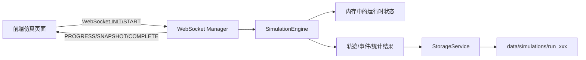

# API 交互关系与历史存储设计说明

## 1. 文档目标

本文档用于统一说明以下内容：

- 当前仿真、存储、回放、训练、分析链路之间的 API 交互关系
- 当前主要数据结构的职责边界
- 为历史数据嵌入路径轨迹后的推荐数据模型
- 为后续扩展性、兼容性、性能优化预留的接口与存储设计原则

本文档不直接约束某个单一实现，而是提供后续接口改造、存储分层和兼容迁移的统一参考。

---

## 2. 当前系统中的主要交互链路

当前系统可以分为四条核心链路：

1. 实时仿真链路
2. 历史回放链路
3. 模型训练链路
4. 统计分析链路

### 2.1 实时仿真链路



当前特点：

- 实时页面通过 WebSocket 驱动仿真启动、暂停、结束
- `SimulationEngine` 负责时间步推进、事件检测、规则评估和采样
- 仿真结束后由 `StorageService` 将结果写入 `data/simulations/run_xxx`
- WebSocket `COMPLETE` 消息当前仍可能承载整份结果数据

当前问题：

- 运行时结果先在内存中累积，再整体落盘
- 完成时若直接回传整份结果，会放大内存与网络开销
- 实时链路与历史链路都隐含依赖单个 `data.json`

### 2.2 历史回放链路

```mermaid
flowchart LR
    A[ReplayPage] --> B[/api/files/output-files]
    A --> C[/api/files/output-file-info]
    A --> D[/api/files/output-file-chunk]
    A --> E[/api/files/output-file]
    B --> F[StorageService + 文件目录]
    C --> G[TrajectoryStorage]
    D --> G
    E --> G
```

当前特点：

- 回放页面优先通过文件列表枚举历史结果
- 通过 `output-file-info` 获取总帧数和配置
- 通过 `output-file-chunk` 分批读取帧
- 旧格式仍可退回到 `output-file`，从 `trajectory_data` 转换为帧

当前问题：

- API 面向文件路径，而不是面向 `run_id`
- 回放接口默认底层是“一个 run 目录 + 一个主文件”
- 对新存储结构的适配能力有限

### 2.3 模型训练链路

```mermaid
flowchart LR
    A[PredictBuilderPage] --> B[/api/prediction/results]
    A --> C[/api/prediction/extract-dataset]
    A --> D[/api/prediction/train]
    A --> E[/api/prediction/evaluate]
    B --> F[data/simulations]
    C --> G[ml_dataset / segment_speed_history]
    D --> H[data/datasets]
    D --> I[data/models]
```

当前特点：

- 训练页先列出历史仿真结果作为候选数据源
- 数据提取接口会优先读取 `ml_dataset`
- 若 `ml_dataset` 不存在，则可能依赖 `segment_speed_history` 重建
- 数据集与模型分开存储在 `data/datasets` 和 `data/models`

当前问题：

- 训练接口强依赖旧目录结构与 `data.json`
- 数据源主键更像“文件名”而不是“运行记录”
- 一旦历史数据结构分层，现有训练提取逻辑会受到明显影响

### 2.4 统计分析链路

```mermaid
flowchart LR
    A[Dashboard/Evaluation/Charts] --> B[/api/analysis/*]
    A --> C[/api/evaluation/*]
    A --> D[/api/files/simulation-gates]
    B --> E[历史结果]
    C --> E
    D --> E
```

当前特点：

- 分析接口默认可以从历史结果中直接提取统计、图表、门架信息
- 一部分页面仍通过文件接口读取辅助数据

当前问题：

- 接口职责边界不够清晰
- 摘要、事件、轨迹、图表生成依赖层次尚未完全分离

---

## 3. 当前主要数据结构与职责

### 3.1 运行时数据

运行时由仿真引擎维护的核心数据可分为五类：

1. 车辆状态
2. 事件日志
3. 时序采样
4. 区段级统计
5. 派生训练数据

推荐按职责理解如下表：

| 数据类型 | 典型字段 | 当前用途 | 性能风险 |
| --- | --- | --- | --- |
| 车辆状态 | `id` `pos` `lane` `speed` | 时间步更新、快照推送 | 数量大、更新频繁 |
| 异常/规则事件 | `timestamp` `type` `severity` | 诊断、规则回放、分析 | 通常不大 |
| 轨迹采样 | `time` `id` `pos` `lane` `speed` | 历史回放、局部分析 | 最大热点之一 |
| 安全采样 | `time` `vehicle_id` `min_ttc` | 风险分析 | 与轨迹一样容易膨胀 |
| 区段统计 | `time` `segment` `avg_speed` `density` | 图表、训练特征 | 中等规模 |

### 3.2 当前历史结果的隐含结构

虽然当前实现可能通过不同文件或不同字段兼容旧格式，但从消费方视角，历史结果大致包含：

```json
{
  "config": {},
  "statistics": {},
  "anomaly_logs": [],
  "trajectory_data": [],
  "segment_speed_history": [],
  "queue_events": [],
  "phantom_jam_events": [],
  "safety_data": [],
  "vehicle_records": [],
  "etc_detection": {},
  "rule_engine": {},
  "ml_dataset": {}
}
```

这个结构的问题不是字段多，而是“摘要层、事件层、轨迹层、训练层”混在一起，导致：

- 任意读取都可能牵扯大对象
- 任意字段扩展都容易让主文件继续膨胀
- 回放、训练、分析无法独立演化

---

## 4. 推荐的历史存储分层

为了兼顾扩展性与性能，历史结果建议拆成四层。

### 4.1 运行索引层

职责：

- 用于列表页、筛选、快速搜索、权限控制、版本兼容判断

推荐字段：

```json
{
  "run_id": "run_20260314_101500",
  "schema_version": "run_v2",
  "created_at": "2026-03-14T10:15:00Z",
  "status": "completed",
  "config_digest": {},
  "summary": {
    "total_vehicles": 1200,
    "total_anomalies": 18,
    "simulation_time": 3600,
    "ml_samples": 420
  },
  "artifacts": {
    "manifest": "manifest.json",
    "trajectory": "trajectory/",
    "events": "events/",
    "metrics": "metrics/",
    "datasets": "datasets/"
  }
}
```

建议持久化位置：

- SQLite 索引表或其他轻量元数据库

### 4.2 Manifest 层

职责：

- 描述这个 run 内有哪些可用数据块
- 记录路径轨迹、道路几何、采样频率、字段版本

推荐字段：

```json
{
  "run_id": "run_20260314_101500",
  "schema_version": "run_manifest_v1",
  "road_topology": {},
  "path_geometry": {},
  "sampling": {
    "trajectory_interval_s": 2,
    "safety_interval_s": 2,
    "metrics_interval_s": 10
  },
  "chunks": {
    "trajectory": [
      {
        "chunk_id": "traj_0000",
        "start_time": 0,
        "end_time": 600,
        "frame_count": 300,
        "file": "trajectory/traj_0000.msgpack"
      }
    ],
    "metrics": [],
    "events": []
  }
}
```

### 4.3 事件层

职责：

- 保存异常、规则命中、噪声注入、门架交易、排队事件、拥堵事件等

事件层特点：

- 可按时间排序
- 可按事件类型过滤
- 不依赖全量轨迹即可做诊断

推荐事件结构：

```json
{
  "event_id": "evt_000123",
  "run_id": "run_xxx",
  "time": 812.0,
  "event_type": "anomaly_triggered",
  "severity": "high",
  "vehicle_id": 57,
  "segment_id": "main_03",
  "payload": {}
}
```

### 4.4 时序明细层

职责：

- 保存轨迹、安全指标、区段级指标等连续数据

建议采用：

- 轨迹：按时间分块的帧格式
- 安全：按时间分块或按车辆分块
- 指标：适合列式格式，优先考虑 Parquet 或紧凑 msgpack

---

## 5. 历史数据中嵌入路径轨迹的目标

### 5.1 为什么要嵌入路径轨迹

当前历史轨迹更偏向“直线路径上的位置表达”：

- `pos`
- `lane`
- `speed`

这种表达足以支撑直线高速公路回放，但对以下场景支持不足：

- 自定义道路几何
- 曲线路段
- 匝道并入并出
- 多段道路拼接
- 按真实路径计算局部拥堵传播或车辆轨迹投影

如果要让历史数据具备更强复用能力，应把“路径语义”持久化到历史记录中，而不是只保留线性位置。

### 5.2 路径轨迹应解决的问题

历史数据中嵌入路径轨迹后，应至少支持：

1. 回放时恢复车辆在曲线路径上的真实投影
2. 训练时提取基于路径的局部特征
3. 分析时按道路段、连接段、匝道段做切片
4. 对旧直线数据保持兼容

---

## 6. 推荐的路径轨迹数据结构

建议将路径轨迹拆为三层：路径几何、车辆路径绑定、轨迹采样引用。

### 6.1 路径几何层

描述道路本身的几何结构，推荐放在 manifest 中。

```json
{
  "path_geometry": {
    "version": "path_geometry_v1",
    "coordinate_system": "local_meter",
    "paths": [
      {
        "path_id": "main_lane_0",
        "road_id": "main",
        "lane_id": 0,
        "polyline": [[0, 0], [100, 0], [200, 5]],
        "length_m": 203.1
      },
      {
        "path_id": "ramp_in_0",
        "road_id": "ramp_in",
        "lane_id": 0,
        "polyline": [[120, -50], [140, -20], [160, 0]],
        "length_m": 58.0
      }
    ]
  }
}
```

设计说明：

- `polyline` 是该路径中心线或主参考线
- `length_m` 供路径投影和回放定位使用
- `path_id` 必须稳定且可跨接口引用

### 6.2 车辆路径绑定层

每辆车不应在每一帧重复写完整折线，而应记录它与路径的关联关系。

```json
{
  "vehicle_path_bindings": {
    "57": {
      "current_path_id": "main_lane_1",
      "planned_path_ids": ["main_lane_1", "main_lane_2"],
      "origin_path_id": "main_lane_1",
      "route_type": "mainline"
    }
  }
}
```

设计说明：

- 用于表达该车当前在哪条路径上
- `planned_path_ids` 为后续换道、汇入、分流预留
- 不要求一开始就完整保存复杂导航，只需先保证路径引用稳定

### 6.3 轨迹采样层

在每一帧中，不再只保存 `pos + lane`，而是保存“路径引用 + 路径内纵向坐标”。

推荐字段：

```json
{
  "t": 120.0,
  "vehicles": [
    {
      "vehicle_id": 57,
      "path_id": "main_lane_1",
      "s": 812.4,
      "offset": 0.0,
      "speed": 21.5,
      "anomaly_type": 0,
      "flags": 0
    }
  ]
}
```

字段说明：

- `path_id`：车辆当前参考路径
- `s`：沿路径累计里程，单位米
- `offset`：相对路径中心线的横向偏移，可先保留为 `0.0`
- `speed`：瞬时速度
- `flags`：受影响状态、异常状态等压缩位

### 6.4 为什么推荐 `path_id + s`，而不是每帧直接存 `(x, y)`

原因如下：

1. `path_id + s` 更紧凑
2. 可以由路径几何反算 `(x, y)`，适合回放和可视化
3. 可以天然兼容直线路径与曲线路径
4. 便于训练阶段提取“沿路径局部窗口”的特征

如果直接每帧存 `(x, y)`：

- 数据量更大
- 不利于按路段分析
- 很难表达车辆已经切换到哪条道路语义路径

因此推荐将 `(x, y)` 视为回放阶段的派生量，而不是历史主存量。

---

## 7. 为路径轨迹嵌入保留的接口设计

为了适配路径轨迹，推荐逐步将文件接口升级为以 `run_id` 为中心的接口。

### 7.1 回放接口

#### 现状

- `GET /api/files/output-files`
- `GET /api/files/output-file-info`
- `GET /api/files/output-file-chunk`
- `GET /api/files/simulation-gates`

#### 推荐目标接口

```text
GET /api/runs
GET /api/runs/{run_id}
GET /api/runs/{run_id}/replay/meta
GET /api/runs/{run_id}/replay/frames?start=0&limit=500
GET /api/runs/{run_id}/replay/window?time_start=600&time_end=900
GET /api/runs/{run_id}/road-geometry
GET /api/runs/{run_id}/events
```

#### `replay/meta` 推荐返回

```json
{
  "run_id": "run_xxx",
  "schema_version": "replay_v2",
  "total_frames": 1800,
  "time_range": [0, 3600],
  "config": {},
  "capabilities": {
    "path_based": true,
    "window_query": true,
    "multi_resolution": false
  },
  "road_geometry": {
    "has_path_geometry": true,
    "path_count": 5
  },
  "gates": []
}
```

#### `replay/frames` 推荐返回

```json
{
  "run_id": "run_xxx",
  "offset": 0,
  "limit": 500,
  "total_frames": 1800,
  "frames": [
    {
      "time": 120.0,
      "vehicles": [
        {
          "id": 57,
          "path_id": "main_lane_1",
          "s": 812.4,
          "offset": 0.0,
          "speed": 21.5,
          "anomaly": 0
        }
      ]
    }
  ]
}
```

兼容建议：

- 旧前端仍可通过适配层把 `path_id + s` 映射回原 `x + lane`
- 新前端则直接消费路径轨迹字段

### 7.2 模型训练接口

#### 现状

- `GET /api/prediction/results`
- `POST /api/prediction/extract-dataset`
- `POST /api/prediction/train`
- `POST /api/prediction/evaluate`

#### 推荐目标

训练数据源应从“文件名”升级为“运行数据源 + 特征视图”。

推荐输入结构：

```json
{
  "run_ids": ["run_a", "run_b"],
  "time_window": {
    "start": 0,
    "end": 3600
  },
  "feature_profile": "segment_and_gate_v2",
  "selected_features": [
    "flow_in",
    "flow_out",
    "path_density",
    "path_speed_gradient"
  ],
  "sampling_strategy": {
    "step_seconds": 60,
    "window_size_steps": 5
  }
}
```

新增路径轨迹后，训练特征可以自然扩展为：

- 某条路径上的平均速度
- 路径局部密度
- 相邻路径速度梯度
- 匝道入口路径拥堵传播速度

这类特征比单纯基于直线 `segment_speed_history` 更适合复杂道路。

### 7.3 分析接口

推荐逐步引入：

```text
GET /api/runs/{run_id}/summary
GET /api/runs/{run_id}/statistics
GET /api/runs/{run_id}/metrics?type=segment_speed
GET /api/runs/{run_id}/metrics?type=path_speed
GET /api/runs/{run_id}/events?event_type=anomaly_triggered
```

其中新增的 `path_speed`、`path_density` 等指标，就是路径轨迹引入后的直接收益。

---

## 8. 兼容迁移原则

由于现有回放、训练、分析均已依赖旧结构，迁移必须遵循兼容优先。

### 8.1 不直接删除旧接口

旧接口建议保留一段时间：

- `/api/files/output-file`
- `/api/files/output-file-info`
- `/api/files/output-file-chunk`
- `/api/prediction/results`

这些接口的内部实现可以逐渐切换到新的 `run_id + manifest + chunk` 存储，但外部返回格式暂时保持兼容。

### 8.2 新旧 schema 共存

建议在每个运行记录上显式写入：

- `schema_version`
- `trajectory_version`
- `path_geometry_version`

兼容策略建议如下：

| 版本 | 特点 | 兼容方案 |
| --- | --- | --- |
| `run_v1` | 主文件 + 平铺轨迹 | 运行时转换为帧 |
| `run_v2` | 分块轨迹 + manifest | 原生按块读取 |
| `run_v2_path` | 分块轨迹 + 路径几何 + `path_id + s` | 回放按路径投影 |

### 8.3 旧数据向新接口暴露时的适配逻辑

对于旧历史数据：

- 若只有 `trajectory_data`，则仍转换为 `frames`
- 若没有 `path_geometry`，则由默认直线路径生成虚拟 `path_id`
- 若没有 `path_id`，则按 `lane` 生成 `main_lane_<lane>` 兼容路径

这样可以保证：

- 新回放前端统一使用 `path_id + s`
- 旧数据仍能被读取

---

## 9. 性能优化约束下的存储设计要求

为了避免“为了保存更多而拖慢仿真”，存储设计需要满足以下约束。

### 9.1 主循环不直接维护超大 JSON 对象

建议：

- 运行时使用紧凑结构缓存
- 每累计一定数量的帧或一定时间窗后分块写盘
- WebSocket `COMPLETE` 不再回传整份结果，只返回 `run_id + summary`

### 9.2 路径几何只保存一次

不允许在每帧重复存储整条折线。

正确方式：

- 路径几何在 manifest 中保存一次
- 轨迹帧中仅保存 `path_id + s + offset`

### 9.3 轨迹按时间块读取

回放接口必须支持：

- 按帧偏移读取
- 按时间窗读取
- 仅加载需要的块

不能要求每次都把整个 run 的轨迹全部展开到内存。

### 9.4 训练接口避免重新扫描全量轨迹

训练接口应优先使用：

- 已存在的 `ml_dataset`
- 已存在的聚合指标
- 预计算路径级特征

只有在必要时才回退到重建逻辑。

---

## 10. 推荐的目录结构

建议未来历史数据逐步演化为以下目录结构：

```text
data/
  simulations/
    run_20260314_101500/
      manifest.json
      summary.json
      road_geometry.json
      trajectory/
        traj_0000.msgpack
        traj_0001.msgpack
      events/
        anomaly_events.jsonl
        etc_transactions.jsonl
        rule_events.jsonl
      metrics/
        segment_metrics.parquet
        path_metrics.parquet
      datasets/
        ml_dataset_segment_v2.json
```

说明：

- `summary.json` 面向列表页和快速概览
- `manifest.json` 面向程序读取和兼容判断
- `road_geometry.json` 面向回放和路径投影
- `trajectory/` 面向高频回放明细
- `events/` 面向诊断和定位
- `metrics/` 面向图表与训练特征

---

## 11. 推荐的接口演进顺序

为降低回放、训练、分析同时受影响的风险，建议按以下顺序推进：

1. 先新增 `run_id` 中心的查询接口，不删除旧接口
2. 将历史索引从目录扫描逐步切换到索引层
3. 在新运行结果中引入 manifest 与路径几何
4. 让回放接口支持 `path_id + s`
5. 让训练接口支持 `run_ids` 而非仅 `file_names`
6. 最后再逐步减少对旧 `/api/files/*` 的依赖

---

## 12. 最终建议

后续设计应坚持以下原则：

- 主标识统一使用 `run_id`
- 数据按“索引、几何、事件、时序、训练”分层
- 路径轨迹以 `path_id + s + offset` 为主表达
- 旧接口保留兼容期，避免一次性打断回放和训练
- 大对象不经由 WebSocket 完整回传
- 新增字段必须带版本号，避免隐式破坏兼容

在这套方案下，历史数据不仅可以嵌入路径轨迹，还能为以下能力打基础：

- 曲线路网回放
- 匝道与多路径分析
- 基于路径的训练特征提取
- 更稳定的历史查询与性能扩展

如果后续开始实施，可继续补充两类配套文档：

- 接口迁移清单
- 历史数据 schema 版本演进说明
