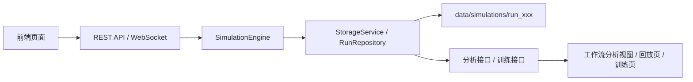
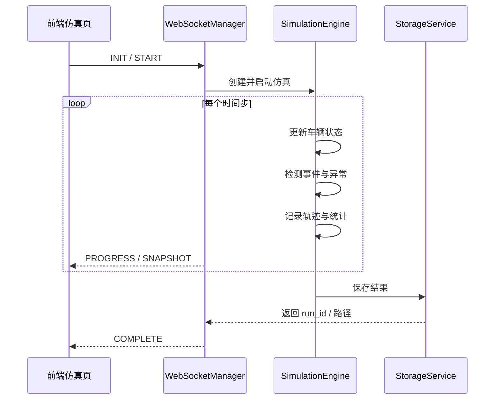

# 系统工作原理

## 1. 文档目标

本文档用于统一说明当前 ETC 仿真系统的工作原理，覆盖以下内容：

- 系统整体分层与模块关系
- 实时仿真、历史存储、回放、训练、分析的运行链路
- 当前核心数据结构
- 现有 REST API 与 WebSocket API 的职责和交互关系
- 历史数据中嵌入路径轨迹后的结构设计
- 性能优化与扩展性约束

本文档描述的是当前代码基础上的实际工作方式与推荐演进方向，既服务于开发维护，也服务于后续重构。

---

## 2. 系统总体架构

系统可以分为六层：

1. 前端交互层
   页面包括仿真运行、回放、工作流编辑、时序预测、评估、看板等。
2. 接口编排层
   由 FastAPI 提供 REST API 与 WebSocket API，对外暴露统一入口。
3. 仿真引擎层
   负责时间步推进、车辆更新、事件检测、统计采样。
4. 历史持久化层
   负责运行结果保存、历史索引、轨迹帧序列化、运行摘要与清单。
5. 分析与训练层
   负责轻量分析图表、数据集提取、模型训练、模型评估。
6. 兼容适配层
   在旧文件接口与新 `run_id` 接口之间提供过渡，保证回放、训练和分析逐步迁移。



---

## 3. 核心运行链路

### 3.1 实时仿真链路

实时仿真的主流程如下：

1. 前端通过 WebSocket 发送初始化、启动、暂停、停止等消息。
2. 后端 WebSocket 管理器创建或控制仿真会话。
3. `SimulationEngine` 按时间步推进仿真状态。
4. 在仿真循环中生成车辆状态、检测异常、积累统计、采样轨迹。
5. 仿真结束后，结果通过存储服务写入运行目录。
6. 前端收到 `PROGRESS`、`SNAPSHOT`、`COMPLETE` 等消息更新界面。



### 3.2 历史回放链路

回放页不再只依赖单个结果文件，而是逐步向 `run_id` 驱动迁移。

当前推荐链路：

1. 前端获取历史运行列表。
2. 选择某个运行后获取回放元信息。
3. 按帧偏移或时间窗口分块读取轨迹帧。
4. 在前端执行全局回放或局部回放渲染。
5. 若来自分析页面的联动跳转，则附带 `run/time/segment` 参数进行定位。

### 3.3 训练链路

训练功能复用历史运行结果：

1. 前端列出可作为训练来源的历史运行。
2. 用户选择若干运行后提取训练数据集。
3. 数据集保存到 `data/datasets`。
4. 训练得到的模型保存到 `data/models`。
5. 模型元数据中记录来源运行、来源数据集、特征配置和指标。

### 3.4 分析链路

分析接口是历史运行结果的轻量视图，不直接回传全部原始数据，而是生成图表友好的聚合结构，包括：

- 全局速度时序
- 区段热力图
- 异常时间分布
- 事件构成
- 区段切换时序
- 异常类型分布
- 回放锚点

---

## 4. 模块职责

### 4.1 前端页面

主要页面及职责：

- 仿真页：控制仿真运行，查看实时进度与快照
- 回放页：浏览历史运行并回放轨迹
- 工作流页：浏览历史数据、模型、数据集与工作流，并显示分析面板
- 时序预测工作台：提取数据集、训练模型、查看历史来源
- 评估页：加载模型与测试数据集进行评估

### 4.2 后端 API

主要接口模块及职责：

- `api/websocket.py`
  实时仿真会话控制
- `api/files.py`
  旧式文件驱动回放兼容接口
- `api/runs.py`
  新式以 `run_id` 为中心的历史运行接口
- `api/prediction.py`
  数据集、模型、训练与评估接口
- `api/workflows.py`
  工作流保存、读取、重命名、复制、删除等接口

### 4.3 仿真引擎

引擎层维护运行时状态：

- 活跃车辆
- 轨迹记录
- 区段统计
- 异常日志
- 规则命中与告警
- 训练衍生数据

### 4.4 存储服务

存储层将内存中的运行结果落盘，并生成：

- `data.json`
- `summary.json`
- `manifest.json`
- 轨迹二进制文件或兼容帧缓存

### 4.5 运行仓储

运行仓储负责：

- 枚举历史运行
- 读取摘要与清单
- 为旧运行回填统计字段
- 为前端分析页提供统一的运行概念

---

## 5. 历史数据工作原理

### 5.1 运行目录模型

每次仿真完成后，会生成一个运行目录，目录名对应一个唯一 `run_id`。

推荐结构：

```text
data/
  simulations/
    run_20260314_101500/
      data.json
      summary.json
      manifest.json
      trajectory.msgpack
      trajectory/
      events/
      metrics/
```

### 5.2 `run_id` 的作用

`run_id` 是历史系统的主标识，承担以下职责：

- 历史列表页的主键
- 分析接口的查询键
- 回放接口的查询键
- 训练来源的引用键
- 模型和数据集元数据中的反向引用键

### 5.3 分层存储的原因

如果所有数据都放在一个大 `data.json` 中，会产生三个问题：

1. 任何功能读取都会拉起大对象。
2. 轨迹和事件会一起膨胀。
3. 回放、分析、训练无法按需加载。

因此推荐分层：

- 摘要层：用于列表页和概览
- 清单层：用于告诉系统有哪些数据可用
- 事件层：用于诊断与异常定位
- 时序层：用于轨迹和指标回放

---

## 6. 关键数据结构

### 6.1 运行摘要 `RunSummary`

运行摘要用于列表页、概览卡片、训练来源展示。

```json
{
  "run_id": "run_20260314_101500",
  "schema_version": "run_v2",
  "summary": {
    "total_vehicles": 1280,
    "total_anomalies": 36,
    "simulation_time": 3600,
    "ml_samples": 420,
    "etc_alerts_count": 12,
    "etc_transactions_count": 1180
  }
}
```

字段说明：

- `run_id`
  历史运行主键
- `schema_version`
  当前运行数据结构版本
- `summary.total_vehicles`
  总车辆数
- `summary.total_anomalies`
  异常总数
- `summary.simulation_time`
  仿真总时长，单位秒
- `summary.ml_samples`
  可用于训练的数据样本数

### 6.2 运行清单 `RunManifest`

运行清单用于说明某次运行有哪些文件、几何数据和采样策略。

```json
{
  "run_id": "run_20260314_101500",
  "schema_version": "run_manifest_v1",
  "sampling": {
    "trajectory_interval_s": 1,
    "metrics_interval_s": 10
  },
  "road_geometry": {
    "gates": [],
    "path_geometry": {}
  },
  "chunks": {
    "trajectory": [],
    "metrics": [],
    "events": []
  },
  "artifacts": {
    "summary": "summary.json",
    "data": "data.json"
  }
}
```

### 6.3 轨迹帧 `TrajectoryFrame`

回放系统消费的核心结构。

```json
{
  "time": 120.0,
  "vehicles": [
    {
      "id": 57,
      "position": 812.4,
      "lane": 1,
      "speed": 21.5,
      "path_id": "main_lane_1",
      "s": 812.4,
      "offset": 0.0,
      "anomaly_type": 0,
      "flags": 0
    }
  ]
}
```

兼容说明：

- 旧回放仍可使用 `position + lane`
- 新结构中同时支持 `path_id + s + offset`
- 对直线道路，`path_id + s` 可退化映射回旧坐标体系

### 6.4 事件 `RunEvent`

```json
{
  "event_id": "evt_000123",
  "run_id": "run_20260314_101500",
  "time": 812.0,
  "event_type": "anomaly_triggered",
  "severity": "high",
  "vehicle_id": 57,
  "segment_id": "3",
  "payload": {
    "reason": "etc_conflict"
  }
}
```

### 6.5 区段时序 `SegmentSeries`

分析接口新增的区段切换图表结构：

```json
{
  "3": [
    {
      "time": 60,
      "avg_speed": 23.1,
      "density": 12.5,
      "flow": 420.0,
      "vehicle_count": 28
    }
  ]
}
```

### 6.6 异常类型分布 `AnomalyTypeBreakdown`

```json
[
  { "name": "etc_conflict", "value": 18 },
  { "name": "queue_spike", "value": 10 },
  { "name": "phantom_jam", "value": 8 }
]
```

### 6.7 回放锚点 `ReplayAnchor`

分析面板与回放联动使用的结构：

```json
[
  {
    "id": "anomaly-0",
    "time": 812.0,
    "position": 1350.5,
    "segment": "3",
    "event_type": "etc_conflict",
    "label": "异常事件 1"
  }
]
```

### 6.8 训练数据集元数据 `DatasetMeta`

```json
{
  "name": "dataset_20260314_01",
  "total_samples": 5400,
  "feature_names": ["flow_in", "flow_out", "avg_speed"],
  "step_seconds": 60,
  "window_size_steps": 5,
  "source_files": ["run_20260314_101500", "run_20260314_114200"]
}
```

### 6.9 模型元数据 `ModelMeta`

```json
{
  "model_id": "model_lstm_20260314",
  "model_type": "lstm",
  "created_at": "2026-03-14T18:20:00Z",
  "trained_samples": 5400,
  "validated_samples": 1200,
  "source_datasets": ["dataset_20260314_01"],
  "source_run_ids": ["run_20260314_101500", "run_20260314_114200"],
  "metrics": {
    "accuracy": 0.91,
    "f1_macro": 0.87
  },
  "hyperparameters": {
    "window_size": 5,
    "hidden_size": 64
  }
}
```

---

## 7. 路径轨迹嵌入原理

### 7.1 为什么要引入路径轨迹

如果只保存：

- `position`
- `lane`

那么系统更适合直线路段，难以自然支持：

- 曲线路段
- 匝道汇入汇出
- 多道路拼接
- 基于真实几何的回放与训练

因此需要把“车辆位于哪条路径上”持久化。

### 7.2 推荐表达方式

推荐在历史数据中使用：

- `path_id`
- `s`
- `offset`

而不是在每一帧都重复保存完整 `(x, y)`。

示例：

```json
{
  "path_id": "main_lane_1",
  "s": 812.4,
  "offset": 0.0
}
```

优势：

1. 比直接保存几何点更紧凑。
2. 更适合按道路语义做分析。
3. 可从路径几何反算回放坐标。
4. 更适合提取路径级训练特征。

### 7.3 路径几何结构

```json
{
  "path_geometry": {
    "version": "path_geometry_v1",
    "coordinate_system": "local_meter",
    "paths": [
      {
        "path_id": "main_lane_1",
        "road_id": "main",
        "lane_id": 1,
        "polyline": [[0, 0], [100, 0], [200, 5]],
        "length_m": 203.1
      }
    ]
  }
}
```

---

## 8. API 设计与交互关系

## 8.1 历史运行接口

### `GET /api/runs`

用途：

- 获取历史运行列表
- 驱动工作流文件管理器、分析面板来源列表

返回：

```json
{
  "runs": [
    {
      "run_id": "run_20260314_101500",
      "name": "run_20260314_101500",
      "path": "run_20260314_101500",
      "modified": "2026-03-14T10:20:00",
      "summary": {
        "total_vehicles": 1280,
        "total_anomalies": 36
      }
    }
  ]
}
```

### `GET /api/runs/{run_id}`

用途：

- 获取单次运行的摘要与清单

### `GET /api/runs/{run_id}/replay/meta`

用途：

- 获取回放元信息
- 供回放页加载前初始化显示

返回关键字段：

- `total_frames`
- `config`
- `summary`
- `sampling`
- `gates`
- `path_geometry`

### `GET /api/runs/{run_id}/replay/frames`

参数：

- `offset`
- `limit`

用途：

- 分块读取回放帧

### `GET /api/runs/{run_id}/events`

参数：

- `event_type`

用途：

- 获取异常、排队、幻象拥堵、ETC 交易等事件

### `GET /api/runs/{run_id}/analysis`

用途：

- 返回工作流页分析面板需要的轻量图表数据

当前返回结构：

```json
{
  "run_id": "run_xxx",
  "summary": {},
  "charts": {
    "speed_timeline": [],
    "segment_heatmap": [],
    "anomaly_timeline": [],
    "event_breakdown": [],
    "segment_series": {},
    "anomaly_type_breakdown": []
  },
  "meta": {
    "time_bins": 24,
    "max_position": 6,
    "duration": 3600,
    "anomaly_bucket_size": 150,
    "segment_options": [],
    "default_segment": "0"
  },
  "replay_anchors": []
}
```

### 历史运行文件操作接口

- `PUT /api/runs/{run_id}/rename`
- `POST /api/runs/{run_id}/copy`
- `DELETE /api/runs/{run_id}`
- `POST /api/runs/{run_id}/open-folder`

用途：

- 用于统一右键菜单能力

## 8.2 回放兼容接口

旧接口仍然存在，用于兼容已有页面和旧历史数据：

- `GET /api/files/output-files`
- `GET /api/files/output-file-info`
- `GET /api/files/output-file-chunk`
- `GET /api/files/output-file`
- `GET /api/files/simulation-gates`

设计原则：

- 外部仍可按文件路径读取
- 内部逐步桥接到 `run_id` 和历史运行目录
- 前端新页面应优先迁移到 `runs` 接口

## 8.3 训练接口

主要接口：

- `GET /api/prediction/results`
- `POST /api/prediction/extract-dataset`
- `POST /api/prediction/train`
- `POST /api/prediction/evaluate`
- `GET /api/prediction/datasets`
- `GET /api/prediction/models`

训练提取接口推荐输入：

```json
{
  "run_ids": ["run_a", "run_b"],
  "time_window": {
    "start": 0,
    "end": 3600
  },
  "feature_profile": "segment_and_gate_v2",
  "selected_features": ["flow_in", "flow_out", "avg_speed"],
  "sampling_strategy": {
    "step_seconds": 60,
    "window_size_steps": 5
  }
}
```

## 8.4 工作流接口

主要接口：

- `GET /api/workflows`
- `GET /api/workflows/{name}`
- `POST /api/workflows`
- `PUT /api/workflows/{name}/rename`
- `POST /api/workflows/{name}/copy`
- `DELETE /api/workflows/{name}`
- `POST /api/workflows/{name}/open-folder`

作用：

- 让工作流页左侧文件管理器对工作流资源进行统一管理

## 8.5 WebSocket 接口

WebSocket 主要消息类型：

- `INIT`
- `START`
- `PAUSE`
- `RESUME`
- `STOP`
- `PROGRESS`
- `SNAPSHOT`
- `COMPLETE`
- `ERROR`

推荐的 `COMPLETE` 负载应以轻量摘要为主：

```json
{
  "type": "COMPLETE",
  "payload": {
    "run_id": "run_20260314_101500",
    "statistics": {},
    "saved_path": "data/simulations/run_20260314_101500"
  }
}
```

不建议在 `COMPLETE` 中直接塞完整结果对象。

---

## 9. 分析联动回放的工作原理

最近的分析增强遵循以下链路：

1. 工作流页选择某个历史运行。
2. 前端请求 `/api/runs/{run_id}/analysis`。
3. 后端返回区段图表、异常类型分布和回放锚点。
4. 用户点击某个锚点。
5. 前端跳转到 `/replay?run=...&time=...&segment=...`。
6. 回放页自动加载对应运行，并尝试按时间和区段定位。

这种设计有三个优点：

1. 分析页面不需要持有完整轨迹。
2. 回放页面仍然保持自己的加载逻辑。
3. 跳转参数简单，后续可继续扩展。

---

## 10. 性能优化原则

### 10.1 为什么分析接口要轻量

分析页面需要的是图表，而不是全部原始帧。轻量分析接口可以：

- 减少网络传输
- 减少前端解析成本
- 降低历史大文件反复读取次数

### 10.2 为什么回放要分块读取

回放的数据量通常最大。按块读取可以：

- 降低首次加载时延
- 降低内存峰值
- 为长时仿真提供可扩展性

### 10.3 为什么训练要复用聚合数据

如果训练每次都从全量轨迹重建特征，代价会很高。更合理的做法是优先使用：

- 预先提取的 `ml_dataset`
- 区段聚合指标
- 路径级统计指标

### 10.4 为什么要保留兼容层

当前回放、训练、分析仍有一部分页面依赖旧接口。如果一次性删除旧接口，会导致：

- 历史数据不可读
- 旧页面断裂
- 重构风险过高

因此应采用：

- 新接口先落地
- 旧接口内部桥接
- 前端分模块迁移

---

## 11. 扩展性设计原则

后续新增功能时，建议遵循以下原则：

1. 新的历史能力优先挂到 `run_id` 体系下。
2. 大对象按“摘要、事件、时序、几何”拆分，而不是继续堆进 `data.json`。
3. 新字段必须带版本语义，避免静默破坏兼容。
4. 几何相关能力统一基于 `path_id + s + offset`。
5. 图表接口返回面向展示的数据，不强迫前端自己重算。
6. 训练接口以“运行来源 + 特征视图”为核心，而不是文件名。

---

## 12. 推荐阅读与后续文档

若需要继续深入，可进一步补充两类文档：

1. 历史数据 schema 版本演进文档
   说明 `run_v1`、`run_v2`、`run_v2_path` 的兼容策略。
2. API 迁移清单文档
   列出旧接口与新接口的一一映射、影响页面和迁移顺序。

与存储和历史回放相关的细节，可继续阅读：

- `docs/storage/README.md`
- `docs/storage/api_interaction_and_history_storage.md`
