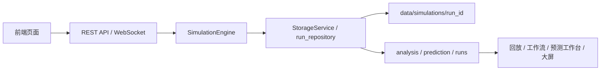

# 系统工作原理

## 1. 文档目标

本文档只描述当前代码中真实存在的系统结构与运行方式，覆盖四个方面：

- 系统架构
- 运行方式
- 运行原理
- API 总览

更细的数学说明放在 `simulation_mechanics.md`，历史存储专题放在 `storage/` 目录。

## 2. 系统架构

系统分为六层：

1. 前端交互层
   由 React + Vite 构建，核心页面由 `frontend/src/App.tsx` 挂载。
2. 接口层
   由 FastAPI 提供 REST API 和 WebSocket。
3. 仿真引擎层
   由 `SimulationEngine` 驱动车辆投放、跟驰、换道、异常、门架和统计。
4. 存储层
   由 `StorageService`、`run_repository`、`TrajectoryStorage` 组织运行结果。
5. 分析与训练层
   由分析、图表、评估和预测接口对历史结果做再加工。
6. 工作流与规则层
   由预警规则引擎和工作流接口管理告警逻辑。



### 2.1 前端页面

当前在 `App.tsx` 中挂载的一级页面是：

- `/purpose` 项目说明
- `/sim` 仿真控制
- `/replay` 可视回放
- `/dashboard` 预警仪表盘
- `/scenarios` 场景模板
- `/workflow` 工作流编辑
- `/files` 文件管理器
- `/editor` 路径编辑
- `/predict-builder` 时序预测工作台
- `/screen` 态势大屏

说明页中的 `EvaluationPage` 代码存在，但未挂载到当前导航，不应写成主流程。

### 2.2 后端入口

后端主入口是 `etc_sim/backend/main.py`，启动时完成：

- 创建 `StorageService`
- 创建 `WebSocketManager`
- 注册 CORS
- 挂载各个 API 路由
- 暴露 `GET /` 和 `GET /health`

独立命令行入口是 `etc_sim/main.py`。它会：

- 读取 JSON 配置或默认配置
- 实例化 `SimulationEngine`
- 执行 `engine.run()`
- 将结果导出并保存到 `data/results`

这两个入口用途不同：

- Web 后端用于页面联动、历史存储、回放、分析和训练
- CLI 入口用于离线仿真和快速验证

## 3. 运行方式

### 3.1 Windows 推荐方式

仓库提供的 `etc_sim/start.bat` 会使用 `low_numpy` 环境启动后端，再启动前端：

```bat
conda run --no-capture-output -n low_numpy python -m uvicorn etc_sim.backend.main:app --host 0.0.0.0 --port 8000
```

随后在 `etc_sim/frontend` 下执行：

```bash
npm run dev
```

### 3.2 手动启动

后端：

```bash
cd etc_sim
python main.py
```

或者：

```bash
uvicorn backend.main:app --reload --host 0.0.0.0 --port 8000
```

前端：

```bash
cd etc_sim/frontend
npm install
npm run dev
```

### 3.3 运行数据位置

- Web 后端历史运行：`etc_sim/data/simulations/<run_id>/`
- CLI 离线结果：`etc_sim/data/results/`
- 训练数据集：`etc_sim/data/datasets/`
- 训练模型：`etc_sim/data/models/`
- 工作流文件：`etc_sim/data/workflows/`

## 4. 运行链路

### 4.1 实时仿真链路

1. 前端仿真页修改参数。
2. 前端通过 WebSocket 控制会话。
3. `SimulationEngine.step()` 按时间步推进。
4. 引擎更新车辆、门架、异常、排队、幽灵堵车和规则事件。
5. 仿真结束后结果写入存储层。
6. 页面读取统计、图表和回放数据。

### 4.2 历史回放链路

1. 前端读取 `runs` 列表。
2. 选择某次运行后读取摘要、清单和轨迹帧。
3. 回放页按时间窗或分页请求帧数据。
4. 分析页可通过锚点跳转到回放页。

### 4.3 训练链路

1. 前端在时序预测工作台选择历史结果。
2. 后端从运行结果中重建特征数据集。
3. 数据集保存到 `data/datasets`。
4. 模型保存到 `data/models`。
5. 训练结果可再次加载或评估。

## 5. 运行原理

### 5.1 仿真时间推进

系统采用离散时间步推进。若当前状态为：

- 位置 `x_t`
- 速度 `v_t`
- 加速度 `a_t`

则更新遵循：

```text
v_{t+Δt} = clamp(v_t + a_t Δt, 0, 1.1 v_0)
x_{t+Δt} = x_t + v_{t+Δt} Δt
```

其中 `v_0` 是车辆期望速度上限，`clamp` 用于限制速度范围。

### 5.2 车辆投放

车辆不是均匀到达，而是由 `VehicleSpawner` 生成非均匀到达序列。其核心是时间变率：

```text
λ(t) = λ_0 · f(t)
```

其中 `f(t)` 是预定义的流量倍率曲线。到达间隔按指数分布抽样：

```text
Δt ~ Exp(λ(t))
```

系统还会按概率生成车队，车队内部车辆之间保持较短时间间隔。

### 5.3 微观行为

纵向行为由 IDM 控制，横向行为由 MOBIL 控制。具体公式见 `simulation_mechanics.md`。

### 5.4 异常、门架和规则

引擎在每个时间步会同时处理：

- ETC 门架交易
- 异常车辆触发与检测
- 噪声注入
- 排队检测
- 幽灵堵车检测
- 预警规则引擎评估

这些事件最终汇总到 `export_to_dict()` 的结果中。

### 5.5 历史结果组织

当前历史运行按 `run_id` 组织。典型目录结构为：

```text
data/
  simulations/
    run_xxx/
      data.json
      summary.json
      manifest.json
      trajectory.msgpack
```

`data.json` 保存完整结果，`summary.json` 用于列表和概览，`manifest.json` 描述路径几何、门架和采样信息，轨迹会被拆分为独立的消息包文件以降低读取成本。

## 6. API 总览

### 6.1 主入口

| 路径 | 方法 | 作用 |
| --- | --- | --- |
| `/` | GET | 返回服务名称、版本和文档地址 |
| `/health` | GET | 健康检查，返回 WebSocket 连接数 |

### 6.2 路由总类

| 模块 | 前缀 | 作用 |
| --- | --- | --- |
| `configs` | `/api/configs` | 仿真配置 CRUD |
| `simulations` | `/api/simulations` | 仿真会话查询、取消、结果读取 |
| `analysis` | `/api/analysis` | 分析摘要、图表和统计 |
| `websocket` | `/api/ws` | 仿真实时控制 |
| `charts` | `/api/charts` | 图表生成、收藏、下载 |
| `environment` | `/api/environment` | 环境状态、天气类型、梯度段 |
| `road_network` | `/api/road-network` | 路网模板、当前配置、预览 |
| `files` | `/api/files` | 文件浏览、脚本管理、旧式回放兼容 |
| `runs` | `/api/runs` | 运行历史、回放、事件、分析 |
| `workflows` | `/api/workflows` | 规则与工作流管理 |
| `evaluation` | `/api/evaluation` | 评估、敏感性分析、优化 |
| `code_execution` | `/api/code` | 环境与脚本执行 |
| `data_packets` | `/api/packets` | 数据包存储与评估 |
| `custom_roads` | `/api/custom-roads` | 自定义路网文件管理 |
| `prediction` | `/api/prediction` | 数据集、模型、训练和加载 |

### 6.3 关键接口清单

#### 配置

- `GET /api/configs`
- `POST /api/configs`
- `GET /api/configs/{config_id}`
- `PUT /api/configs/{config_id}`
- `DELETE /api/configs/{config_id}`
- `POST /api/configs/{config_id}/duplicate`

#### 仿真

- `GET /api/simulations`
- `GET /api/simulations/{simulation_id}`
- `GET /api/simulations/{simulation_id}/results`
- `POST /api/simulations/{simulation_id}/cancel`
- `DELETE /api/simulations/{simulation_id}`

#### 历史运行

- `GET /api/runs`
- `GET /api/runs/{run_id}`
- `GET /api/runs/{run_id}/replay/meta`
- `GET /api/runs/{run_id}/replay/frames`
- `GET /api/runs/{run_id}/events`
- `GET /api/runs/{run_id}/analysis`
- `GET /api/runs/{run_id}/images`
- `GET /api/runs/{run_id}/gates`

#### 工作流

- `GET /api/workflows/rules`
- `POST /api/workflows/rules`
- `PUT /api/workflows/rules/{rule_name}`
- `DELETE /api/workflows/rules/{rule_name}`
- `PATCH /api/workflows/rules/{rule_name}/toggle`
- `POST /api/workflows/import`
- `GET /api/workflows/export`
- `GET /api/workflows/engine/status`
- `GET /api/workflows/engine/events`

#### 预测与训练

- `POST /api/prediction/train`
- `POST /api/prediction/evaluate`
- `POST /api/prediction/extract-dataset`
- `GET /api/prediction/results`
- `GET /api/prediction/models`
- `GET /api/prediction/datasets`

#### 其他

- `GET /api/charts`
- `POST /api/charts/generate`
- `GET /api/files/output-files`
- `GET /api/files/output-file`
- `GET /api/files/output-file-info`
- `GET /api/files/output-file-chunk`
- `POST /api/code/execute`
- `POST /api/custom-roads/`
- `GET /api/road-network/preview`

## 7. 数据流结论

当前系统的核心不是“生成一份报表”，而是“把同一份仿真结果服务给多个使用场景”：

- 实时控制依赖 WebSocket
- 历史回放依赖 `run_id`
- 分析依赖聚合后的时序和事件
- 训练依赖从历史结果重建的数据集
- 规则与预警依赖工作流引擎

## 8. 补充说明

- WebSocket 控制入口是 `/api/ws/simulation` 和 `/api/ws/simulation/{session_id}`，页面侧主要用于仿真开始、暂停、恢复和停止。
- `SimulationEngine.export_to_dict()` 会一次性导出轨迹、异常日志、门架统计、队列事件、幽灵堵车事件、安全数据、ETC 交易和规则引擎事件。
- CLI 入口保存到 `data/results`，Web 运行保存到 `data/simulations`，两者不是同一个历史仓库。
