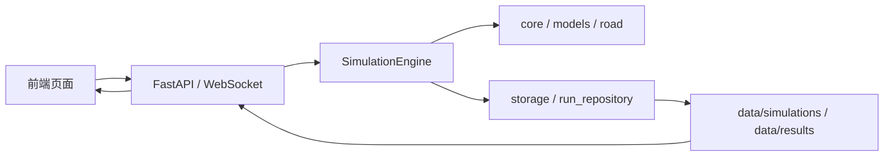

# 系统工作原理

## 1. 文档目标

本文档只描述当前代码里真实存在的系统结构与运行方式，回答四个问题：

- 系统由哪些层组成。
- 系统如何启动、如何运行、如何结束。
- 仿真、存储、回放、分析、训练之间如何衔接。
- 后端 API 该如何按模块理解与使用。

更细的数学推导放在 [simulation_mechanics.md](./simulation_mechanics.md)，历史存储细节放在 [storage/api_interaction_and_history_storage.md](./storage/api_interaction_and_history_storage.md)。

---

## 2. 总体架构

当前系统可以稳定分成六层：

1. 前端展示层
   - React + Vite 单页应用。
   - 负责仿真控制、回放、仪表盘、场景模板、工作流、文件管理、路径编辑、预测工作台和态势大屏。
2. 接口层
   - FastAPI 提供 REST API 和 WebSocket。
   - 负责配置、仿真会话、运行历史、分析、图表、环境、路网、工作流、预测和代码执行。
3. 仿真引擎层
   - `etc_sim/simulation/engine.py`
   - 负责时间步推进、车辆生成、车辆更新、门架交易、异常检测、排队检测、幽灵堵车检测、规则引擎事件和特征数据导出。
4. 领域模型层
   - `etc_sim/core/`、`etc_sim/models/`、`etc_sim/road/`
   - 负责 IDM/MOBIL、道路网络、ETC 门架、异常识别、环境影响、告警规则和训练特征。
5. 存储与仓储层
   - `etc_sim/backend/services/`
   - 负责运行结果、摘要、清单、轨迹、模型、数据集和历史索引。
6. 兼容层
   - `etc_sim/backend/api/files.py`、`etc_sim/backend/api/runs.py`
   - 旧文件式读取与新的 `run_id` 驱动历史系统并存，逐步迁移。

---

## 3. 运行方式

### 3.1 命令行仿真

命令行入口是 [etc_sim/main.py](/E:/Project/yulu/etc_sim/main.py)。

实际流程是：

1. 读取命令行参数。
2. 从 JSON 文件加载 `SimulationConfig`，或者使用 `DEFAULT_CONFIG`。
3. 构建 `SimulationEngine(config)`。
4. 调用 `engine.run()` 完成离散时间步仿真。
5. 调用 `engine.export_to_dict()` 导出结果。
6. 将结果写入 `data/results/` 下的 JSON 文件。

这个入口适合单机批处理、算法调试和快速验证配置。

### 3.2 后端服务

FastAPI 应用入口是 [etc_sim/backend/main.py](/E:/Project/yulu/etc_sim/backend/main.py)。

实际流程是：

1. 启动时初始化 `StorageService` 与 `WebSocketManager`。
2. 通过 CORS 放行本地前端地址。
3. 挂载各类 API 路由。
4. 提供 `/health` 健康检查和 `/` 根状态接口。
5. 在 WebSocket 会话内驱动实时仿真并推送状态。

### 3.3 前端运行

前端入口是 [etc_sim/frontend/src/App.tsx](/E:/Project/yulu/etc_sim/frontend/src/App.tsx)。

当前实际挂载的一级页面是：

- `/purpose`
- `/sim`
- `/replay`
- `/dashboard`
- `/scenarios`
- `/workflow`
- `/files`
- `/editor`
- `/predict-builder`
- `/screen`

`EvaluationPage` 文件存在，但未挂载到主导航，不应写入对外主流程说明。

---

## 4. 核心运行链路

### 4.1 实时仿真链路

1. 前端选择配置、场景和路网参数。
2. 后端 WebSocket 会话创建或接管仿真。
3. `SimulationEngine` 按固定 `dt` 推进状态。
4. 每个时间步内完成：
   - 车辆投放
   - 空间索引重建
   - IDM 跟驰更新
   - MOBIL 换道决策
   - ETC 门架交易处理
   - 异常、排队和幽灵堵车检测
   - 轨迹、区间速度、告警和规则事件记录
5. 仿真结束后，结果被导出为可存储、可回放、可训练的结构。

### 4.2 历史回放链路

当前推荐使用 `run_id` 驱动历史数据：

1. 通过 `/api/runs` 获取运行列表。
2. 选择某个 `run_id`。
3. 读取回放元信息、帧数据和分析结果。
4. 前端按时间窗、区间和事件锚点重建回放。

旧文件式接口仍然保留在 `/api/files`，主要用于兼容历史数据和脚本工具。

### 4.3 分析与训练链路

分析和训练都复用同一份历史运行结果：

- 分析接口从运行结果中提取摘要、统计和图表数据。
- 训练接口从历史运行或数据集重建时序特征。
- 模型和数据集都带有来源追踪信息，便于回溯。

---

## 5. 仿真原理概览

仿真引擎是离散时间步系统。可以把它理解为：

`state(t + dt) = F(state(t), config, environment, rules)`

其中：

- `state` 包含车辆、门架、异常、统计和环境状态。
- `config` 决定道路长度、车道数、车辆总量、异常比例和检测阈值。
- `environment` 提供天气和环境影响。
- `rules` 提供告警规则和工作流联动。

更具体的数学关系如下：

- 纵向运动由 IDM 描述。
- 横向换道由 MOBIL 描述。
- 车辆群体由异质参数随机采样得到。
- 排队、幽灵堵车和门架异常是对状态的规则化识别。

详细公式见 [simulation_mechanics.md](./simulation_mechanics.md)。

---

## 6. 后端 API 索引

以下是当前主干 API，按模块分组列出。

### 6.1 基础接口

- `GET /`
  - 根状态信息。
- `GET /health`
  - 健康检查和 WebSocket 连接数。

### 6.2 配置

前缀：`/api/configs`

- `GET /`
- `POST /`
- `GET /{config_id}`
- `PUT /{config_id}`
- `DELETE /{config_id}`
- `POST /{config_id}/duplicate`

### 6.3 仿真会话

前缀：`/api/simulations`

- `GET /`
- `GET /{simulation_id}`
- `DELETE /{simulation_id}`
- `POST /{simulation_id}/cancel`
- `GET /{simulation_id}/results`

### 6.4 分析

前缀：`/api/analysis`

- `GET /{simulation_id}/summary`
- `GET /{simulation_id}/charts/{chart_type}`
- `GET /{simulation_id}/statistics`

### 6.5 WebSocket

前缀：`/api/ws`

- `WS /simulation`
- `WS /simulation/{session_id}`
- `GET /test`

### 6.6 图表

前缀：`/api/charts`

- `POST /generate`
- `GET /`
- `GET /favorites`
- `GET /{chart_id}`
- `GET /{chart_id}/download`
- `POST /{chart_id}/favorite`
- `DELETE /{chart_id}/favorite`

### 6.7 环境

前缀：`/api/environment`

- `GET /`
- `PUT /`
- `GET /weather-types`
- `POST /gradients`
- `DELETE /gradients`

### 6.8 路网

前缀：`/api/road-network`

- `GET /templates`
- `GET /current`
- `PUT /current`
- `GET /preview`

### 6.9 文件与脚本

前缀：`/api/files`

- `GET /output-files`
- `GET /output-file`
- `GET /output-file-info`
- `GET /output-file-chunk`
- `GET /simulation-gates`
- `GET /scripts/tree`
- `GET /scripts/list`
- `GET /scripts/read`
- `POST /scripts/save`
- `POST /scripts/run`

### 6.10 历史运行

前缀：`/api/runs`

- `GET /`
- `GET /{run_id}`
- `GET /{run_id}/replay/meta`
- `GET /{run_id}/replay/frames`
- `GET /{run_id}/events`
- `GET /{run_id}/analysis`
- `PUT /{run_id}/rename`
- `POST /{run_id}/copy`
- `DELETE /{run_id}`
- `POST /{run_id}/open-folder`
- `GET /{run_id}/images`
- `GET /{run_id}/images/{image_name}`
- `GET /{run_id}/gates`

### 6.11 工作流

前缀：`/api/workflows`

- `GET /conditions/types`
- `GET /actions/types`
- `GET /rules`
- `GET /rules/{rule_name}`
- `POST /rules`
- `PUT /rules/{rule_name}`
- `DELETE /rules/{rule_name}`
- `PATCH /rules/{rule_name}/toggle`
- `POST /workflows/import`
- `GET /workflows/export`
- `GET /workflows/files`
- `GET /workflows/files/read`
- `POST /workflows/files/save`
- `PUT /workflows/files/rename`
- `POST /workflows/files/copy`
- `DELETE /workflows/files`
- `POST /workflows/files/open-folder`
- `POST /workflows/reset`
- `GET /workflows/active-rules`
- `GET /engine/status`
- `GET /engine/events`

### 6.12 评估、代码执行与预测

- `/api/evaluation`
  - `GET /metrics`
  - `POST /evaluate`
  - `GET /summary`
  - `POST /run`
  - `POST /evaluate-file`
  - `POST /sensitivity`
  - `POST /optimize`
- `/api/code`
  - `POST /execute`
  - `GET /environments`
  - `POST /environments`
  - `DELETE /environments/{name}`
  - `POST /packages/install`
  - `GET /environments/{name}/packages`
- `/api/prediction`
  - `POST /train`
  - `POST /evaluate`
  - `GET /models`
  - `POST /load`
  - `GET /results`
  - `POST /extract-dataset`
  - `GET /datasets`
  - `DELETE /models/{model_id}`
  - `PUT /models/{model_id}/rename`
  - `POST /models/{model_id}/open-folder`
  - `POST /models/{model_id}/copy`
  - `DELETE /datasets/{dataset_name}`
  - `PUT /datasets/{dataset_name}/rename`
  - `POST /datasets/{dataset_name}/open-folder`
  - `POST /datasets/{dataset_name}/copy`
- `/api/packets`
  - `GET /`
  - `GET /{packet_id}`
  - `DELETE /{packet_id}`
  - `POST /{packet_id}/evaluate`
  - `POST /store`
- `/api/custom-roads`
  - `GET /`
  - `GET /{filename}`
  - `POST /`
  - `PUT /{filename}`
  - `DELETE /{filename}`

---

## 7. 维护约定

- 新增路由时，同时更新本文件的 API 索引。
- 新增页面时，同时更新 `App.tsx` 里的导航并补充讲稿。
- 新增仿真公式或阈值时，同时更新 [simulation_mechanics.md](./simulation_mechanics.md)。
